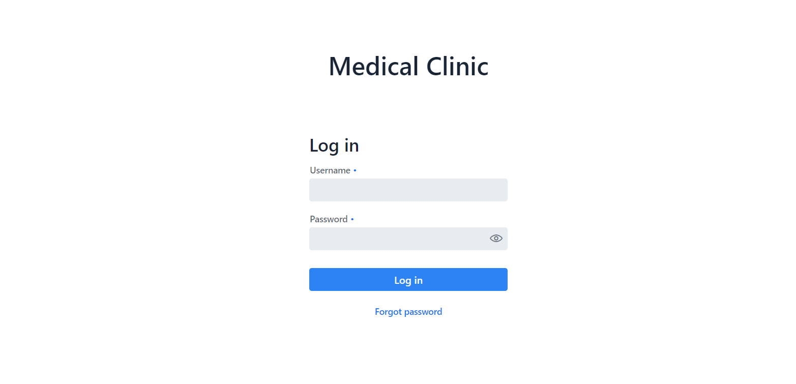

<h1> Medical Clinic Project </h1>

<<<<<<< HEAD
Projekt przychodni medycznej. Jest utrzymany w formie strony 
internetowej, na którą można się zalogować, umówić wizytę albo 
zmienić swoje dane.

Projekt ma osobną strukturę dla backendu i frontendu.
Link do backendu: https://github.com/krzysztofplociennik/medical-clinic-backend

**Stack**

Przy projekcie korzystałem z:
- java 8
- hibernate
- mysql
- spring boot
- spring security
- vaadin
=======
This medical clinic project has a form of a website where you can login, setup an appointment or change your credentials. 
>>>>>>> d5f668b81410a6edc27d522b9772272d57e17d7c

The project has a separate backend and frontend. Backend:
https://github.com/krzysztofplociennik/medical-clinic-backend

<<<<<<< HEAD
Na chwilę obecną jest 3 użytkowników z następującymi danymi = login | hasło: 
1. jamilyn | jaha
2. mariof | mafe
3. ryahn | ryhi

Dodatkowo można też zalogować się jako admin: 
admin | 123

**Jak wygląda strona?**

Login:

Dash użytkownika: 

Rezerwowanie wizyt:

Można też konkretne wizyty usunąć z bazy, zaznaczając konkretny 
rekord:

Strona dostępnych lekarzy (dodatkowo można sprawdzić, jak zostali 
ocenieni oraz sami możemy ocenić ich):

Na samym końcu mamy możliwość podejrzenia danych zalogowanego
użytkownika oraz ich edycji (oprócz loginu):

Logując się jako admin mamy dodatkowo dostęp do jeszcze jednej 
zakładki na stronie: 

Można w niej zobaczyć listę pacjentów, lekarzy, rezerwacji oraz ocen.
Przy wybraniu konkretnego obiektu pokazują się jego dane:

oraz możliwość usunięcia z bazy danego obiektu (co też poprzedzone jest
wymaganym potwierdzeniem):

**Deploy**

W trakcie...
=======
**Stack**

- java 8
- hibernate
- mysql
- spring boot
- spring security
- vaadin

**How to use?***

For a time being there are 3 users with credentials (login | password): 
1. jamilyn | jaha
2. mariof | mafe
3. ryahn | ryhi

Additionally it is possible to login as an administrator: 
admin | 123

*Currently the website is not deployed.

**How does the website look like?**

Login view:

User's dash: 

Appointments page:

You can also delete certain records that are highlighted:

Available doctors page (you can check their rating as well or rate them yourself):

The last tab gives you the ability to see the credentials of the logged user. There's also an option to edit them (username can't be edited):

When logging in as an admin you can spot another tab:

Here you can check the patients, doctors, appointments and ratings. While selecting a desired record you can see various information about them:

and if you feel like it you can delete the object as well (and then confirm or cancel the decision):

**Deploy**

In progress...
>>>>>>> d5f668b81410a6edc27d522b9772272d57e17d7c
